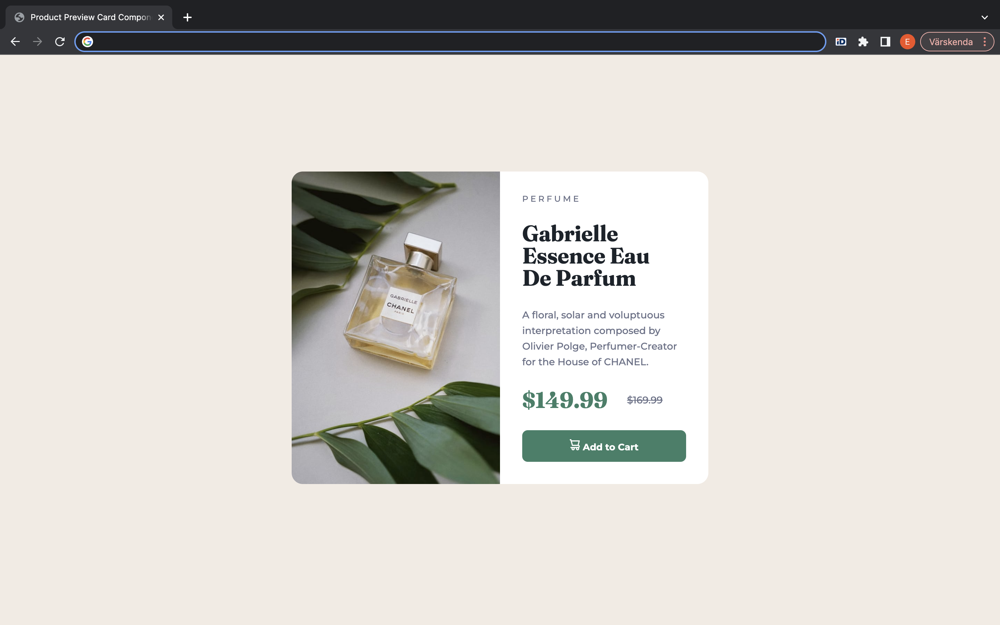

# Frontend Mentor - Product preview card component solution

This is a solution to the [Product preview card component challenge on Frontend Mentor](https://www.frontendmentor.io/challenges/product-preview-card-component-GO7UmttRfa). Frontend Mentor challenges help you improve your coding skills by building realistic projects. 

## Table of contents

- [Overview](#overview)
  - [The challenge](#the-challenge)
  - [Screenshot](#screenshot)
  - [Links](#links)
- [My process](#my-process)
  - [Built with](#built-with)
  - [What I learned](#what-i-learned)
  - [Useful resources](#useful-resources)
- [Author](#author)
- [Acknowledgments](#acknowledgments)

**Note: Delete this note and update the table of contents based on what sections you keep.**

## Overview

### The challenge

Users should be able to:

- View the optimal layout depending on their device's screen size
- See hover and focus states for interactive elements

### Screenshot

### Links

- Solution URL: (https://github.com/Ejc2us10/Product-Preview-Card-Component)
- Live Site URL: (https://ejc2us10.github.io/Product-Preview-Card-Component/)

## My process

### Built with

- Semantic HTML5 markup
- CSS custom properties
- Flexbox

### What I learned

I started grasping the media query step by step, though there is a huge room for me yet to be discovered.

I appreciate your feedback beforehand!

### Useful resources

- 【レスポンシブ】PCとスマホで違う画像に切り替える方法！CSSだけで簡単画像切り替え！(https://fastcoding.jp/blog/all/frontend/responsive_img/) - For Japanese speakers: this helped me to learn how to switch the images when seen on desktop and smartphone.

## Author

- Website - [Ejc2us10](https://github.com/Ejc2us10)
- Frontend Mentor - [@Ejc2us10](https://www.frontendmentor.io/profile/Ejc2us10)
- Twitter - [@yourusername](https://www.twitter.com/yourusername)

**Note: Delete this note and add/remove/edit lines above based on what links you'd like to share.**

## Acknowledgments

Thank you @DavidMorgade for your helpful advice on my previous task! It helped me to bring the card to the middle of the screen at once.